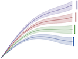

#  Definitions of common terms for the openENTRANCE project

Copyright 2020 openENTRANCE consortium

   Licensed under the Apache License, Version 2.0 (the "License");
   you may not use this file except in compliance with the License.
   You may obtain a copy of the License at

     http://www.apache.org/licenses/LICENSE-2.0

   Unless required by applicable law or agreed to in writing, software
   distributed under the License is distributed on an "AS IS" BASIS,
   WITHOUT WARRANTIES OR CONDITIONS OF ANY KIND, either express or implied.
   See the License for the specific language governing permissions and
   limitations under the License.

## Aim and scope of this repository

The [Horizon 2020 openENTRANCE project](https://openentrance.eu) aims at
developing, using and disseminating an open, transparent and integrated
modelling platform for assessing low-carbon transition pathways in Europe.
A key requirement for an effective linking of models and consistent analysis is
a common "nomenclature", i.e., shared lists of variables, regions and units
used across the entire project.

This repository makes available the nomenclature used within the consortium and
serves as a discussion platform for extending the lists of terms.

*We invite other modelling teams to contribute and join the discussion,
hoping to facilitate increased cooperation across research projects
on (European) energy and climate policy!*

## Data format structure

The openENTRANCE project uses a **common data format** based on a template
developed by the [Integrated Assessment Modeling Consortium (IAMC)](http://www.globalchange.umd.edu/iamc/)
and already in use in many model comparison projects at the global and national
level. While the IAMC comprises (mostly) integrated-assessment teams, the data
format is generic and can be used for a wide range of applications, including
energy-systems analysis or modelling of specific sectors like transport,
industry or the building stock.

### Timeseries data dimensions

In the data format, every timeseries is described by six dimensions (codes):

1.	Model - [more information](model)
2.	Scenario - [more information](scenario)
3.	Region - [more information](region)
4.	Variable - [more information](variable)
5.	Unit
6.	Subannual (optional, default 'Year')[1]

**Work in progress**: A detailed description of these dimensions and the shared
terms (i.e., codelists) will be added soon!

[1] *The index 'Subannual' is an extension of the original format introduced by
the openENTRANCE project to accomodate data at a subannual temporal resolution.*

### Recommended usage of this data format

The Python package **pyam** was developed to facilitate working with timeseries
data conforming to this structure. Features include validation of values,
aggregation and downscaling of data, and import/export with various file formats
(`xlsx`, `csv`, ...) and table layouts (wide vs. long data).

[Read the docs](https://pyam-iamc.readthedocs.io) for more information!

## Funding acknowledgement

This project has received funding from the European Union’s Horizon 2020 research
and innovation programme under grant agreement No. 835896.
